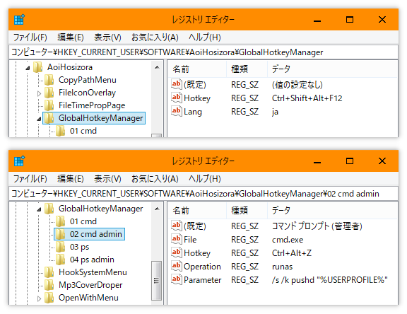

# GlobalHotkeyManager

+ A Windows background tool built by Qt used to manage global hotkeys.

### Environment

+ Qt 5.15.2 (MinGW 8.1.0 64-bit)
+ Windows 10 21H2 x64

### Build and deploy

+ Build

```bash
# 1. Qmake and generate Makefile
mkdir build
cd build
qmake ..

# 2. Build in debug mode (with console)
make debug
# Or build in release mode (without console)
make release
# Or build both in debug and release modes
make all

# 3. Initialize registry config
default_config.reg # only contains application default configuration
# Or
example_config.reg # contains application default configuration and four hotkeys

# 4. Run the built executable
./build/debug/GlobalHotkeyManager.exe
# Or
./build/release/GlobalHotkeyManager.exe
```

+ Build with multi-language supported (English, Simplified Chinese, Japanese)

```bash
# 1. Build qm files from current ts files
lrelease GlobalHotkeyManager.pro

# 2. Build qt_zh_CN.qm
lconvert -o res/qt_zh_CN.ts <Qt installation path>/translations/qt_zh_CN.qm
sed -i "s/QDialogButtonBox/QPlatformTheme/g" res/qt_zh_CN.ts # fix QMessageBox translation bug in Chinese
lrelease res/qt_zh_CN.ts -qm res/qt_zh_CN.qm

# 3. Build qt_ja_JP.qm
lconvert -o res/qt_ja_JP.ts <Qt installation path>/translations/qtbase_ja.qm <Qt installation path>/translations/qtdeclarative_ja.qm
lrelease res/qt_ja_JP.ts -qm res/qt_ja_JP.qm

# 4. Build GlobalHotkeyManager again
cd build
make debug
```

+ Deploy with Qt dependencies

```bash
# 1. Build GlobalHotkeyManager in release mode first
cd build
make release

# 2. Deploy to self-contained folder
cd ..
mkdir dist
cp build/release/GlobalHotkeyManager.exe dist/GlobalHotkeyManager.exe
windeployqt dist/GlobalHotkeyManager.exe

# 3. Run the deployed executable (which can be executed in environment without qt)
./dist/GlobalHotkeyManager.exe
```

### Configure

+ Configurations are saved in registry `HKEY_CURRENT_USER\SOFTWARE\AoiHosizora\GlobalHotkeyManager`, which is almost the same as [Aoi-hosizora/OpenWithMenu](https://github.com/Aoi-hosizora/OpenWithMenu#configure).
+ Note that you need to make sure that `regjump.exe` can be found in `PATH`, which is used for registry redirecting. Please visit https://docs.microsoft.com/en-us/sysinternals/downloads/regjump for details.

```reg
; From example_config.reg

[HKEY_CURRENT_USER\SOFTWARE\AoiHosizora\GlobalHotkeyManager]
"Hotkey"="Ctrl+Shift+Alt+F12"
"Lang"="en"

[HKEY_CURRENT_USER\SOFTWARE\AoiHosizora\GlobalHotkeyManager\01 cmd]
@="Command Prompt"
"Parameter"="/s /k pushd \"%USERPROFILE%\""
"Hotkey"="Ctrl+Alt+X"
"File"="cmd.exe"

[HKEY_CURRENT_USER\SOFTWARE\AoiHosizora\GlobalHotkeyManager\02 cmd admin]
@="Command Prompt (Admin)"
"Operation"="runas"
"Parameter"="/s /k pushd \"%USERPROFILE%\""
"Hotkey"="Ctrl+Alt+Z"
"File"="cmd.exe"
```

#### Root key

+ `Hotkey` - Hotkey to open the config dialog, defaults to `Ctrl+Shift+Alt+F12`
+ `Lang` - Language, defaults to `en`, available items: `en` or `en_us`, `zh` or `zh_cn`, `ja` or `ja_jp`

#### Sub key

+ `key name` - Hotkey ID, **required**, it is actually useless except sorting hotkey items
+ `@` - Hotkey title, **required**
+ `File` - Executable file path, **required**
+ `Hotkey` - Hotkey for executable file, **required**
    + Some examples: `F10` / `Shift+Esc` / `Ctrl+Alt+0` / `Ctrl+Shift+Alt+Z` / `Ctrl+Win+Insert`
+ `Operation` - Execute operation, defaults to `open`, it can be set to `runas` to execute as administrator
+ `Parameter` - Execute parameter, optional
    + Command prompt example: `/s /k pushd "%USERPROFILE%"`
    + Powershell example: `-noexit -command Set-Location -literalPath "$env:USERPROFILE"`
+ `Directory` - Working directory to execute file, optional
+ `Style` - Window style when executing, defaults to `SW_NORMAL`, it can be set to `SW_HIDE` or `0` to hide window

### Screenshots

|||
|---|---|

### Reference

+ [ddqd/qxtglobalshortcut5](https://github.com/ddqd/qxtglobalshortcut5)
+ [Aoi-hosizora/OpenWithMenu](https://github.com/Aoi-hosizora/OpenWithMenu)
+ [ShellExecuteW function (shellapi.h)](https://docs.microsoft.com/en-us/windows/win32/api/shellapi/nf-shellapi-shellexecutew)
+ [RegOpenKeyExW function (winreg.h)](https://docs.microsoft.com/en-us/windows/win32/api/winreg/nf-winreg-regopenkeyexw)
+ [List of Stylable Widgets - QListView](https://doc.qt.io/qt-5/stylesheet-reference.html#qlistview-widget)
+ [Deploying Translations](https://doc.qt.io/qt-5/linguist-programmers.html#deploying-translations)
+ [Undocumented QMake](https://wiki.qt.io/Undocumented_QMake)
